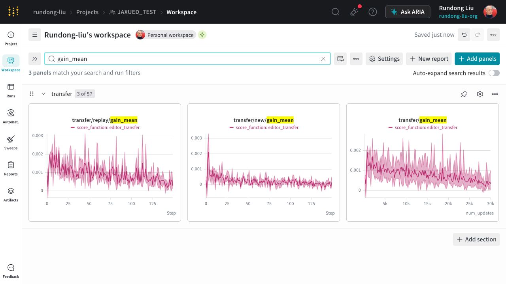
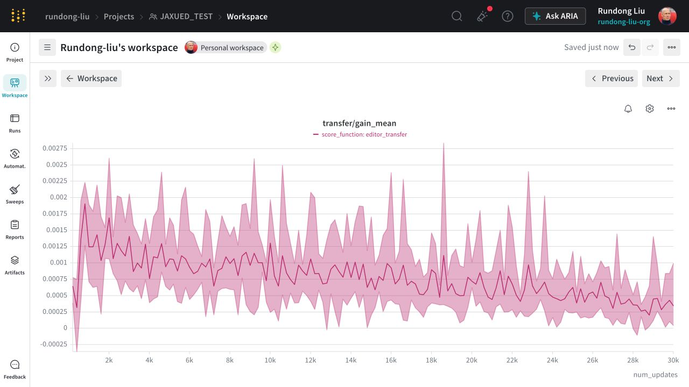
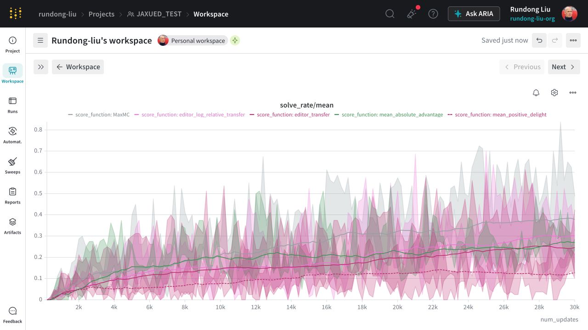

# Non-Competitive UED

## Motivation

**Non-Competitive UED** is an exploratory research project that aims to train reinforcement-learning agents with state-of-the-art generalisation across a distribution of partially observable Markov decision processes (POMDPs).
Influential unsupervised environment design (UED) methods treat curriculum generation as an interaction between a learning agent and a mechanism that selects or creates useful environments: adversarial approaches such as [PAIRED](https://arxiv.org/abs/2012.02096) explicitly train an environment designer to maximise estimated student regret, while approaches such as [Prioritized Level Replay (PLR)](https://arxiv.org/abs/2010.03934) use regret-related signals, including temporal-difference error, as practical estimates of a level's future learning potential. These approximations are intended to identify environments near the agent's *zone of proximal development*—tasks that are neither already mastered nor currently impossible, but lie at the frontier of what the agent can learn next.

This strategy works well in relatively saturated domains such as maze navigation, where strong policies and useful regret estimates can be obtained; however, in complex, partially observable and open-ended domains such as [Craftax](https://arxiv.org/abs/2402.16801), reliable regret estimation is much harder because success depends on long-horizon exploration, planning, memory and adaptation, and existing UED methods have made limited progress.

The project therefore investigates alternative measures, particularly information gain and cross environment learning transfer, to determine which environments genuinely expand the agent's capabilities rather than merely appear difficult.

If these measures generalise across several established RL environments, the longer-term goal is to apply the same principle to language models by building task generators that can discover verifiable *frontier tasks* tailored to the current capabilities of black-box or closed-source LLMs, closely aligning with [SPADE's adaptive self-play in synthetic executable environments](https://benjamin-eecs.github.io/blog/2026/spade/).

## Transfer gain achieved so far

The following W&B panels compare the six finished `editor_transfer` runs currently recorded in `rundong-liu/JAXUED_TEST`. Transfer gain is the change in return on an edited target bank after updating the policy on a source environment, so a positive value indicates that the source update also improved performance on nearby environments. The grouped results remain mostly positive, but the gain declines over training; replay levels retain a clearer residual signal than newly generated levels. These plots are descriptive evidence of measured local transfer, not yet proof that transfer-based prioritisation outperforms a matched baseline.

*Replay, fresh-level, and overall mean transfer gain across the completed W&B cohort.*

*Overall mean transfer gain remains positive on average but compresses toward zero as training progresses.*

### Solve-rate comparison across methods

The W&B comparison below shows mean solve rate for the finished MaxMC, editor-transfer, log-relative editor-transfer, mean-absolute-advantage, and mean-positive-delight runs. The methods improve at different rates and show substantial cross-run variation. Because the visible method groups contain different numbers of seeds and transfer scoring incurs additional evaluation work, this is a descriptive comparison by training update rather than a matched-compute performance ranking.

*Mean solve rate by scoring method over 30,000 training updates; shaded regions show the dispersion within each visible W&B method group.*

## Progress
